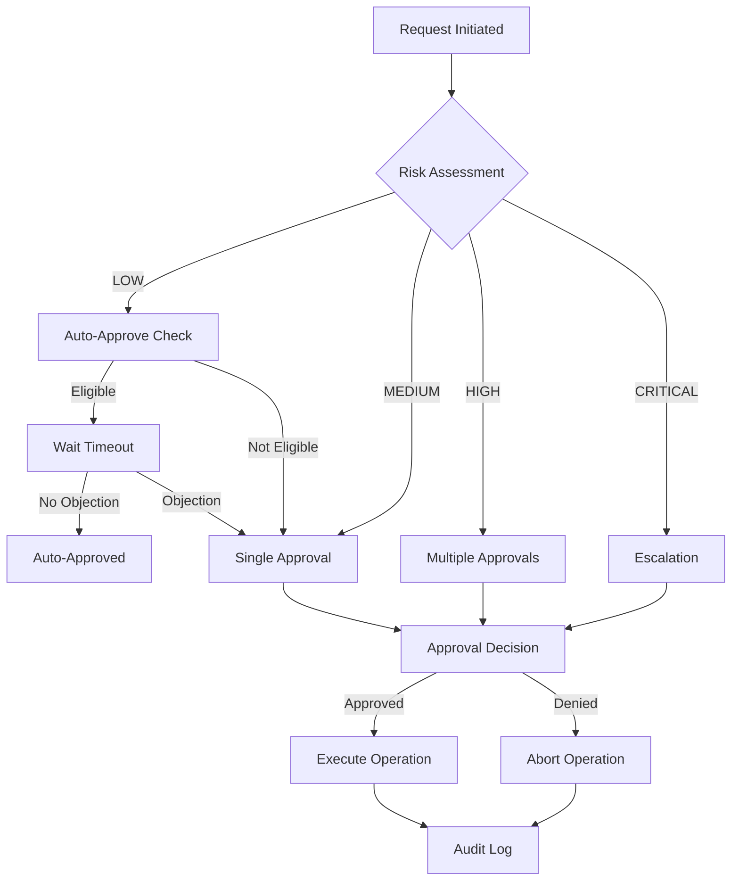
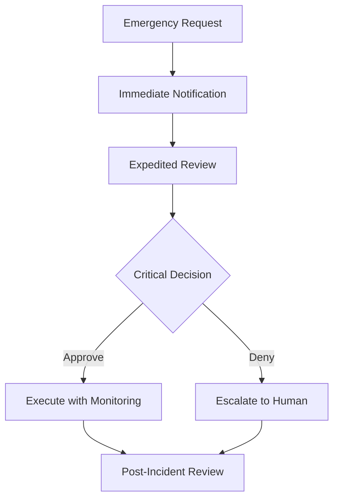

---
name: approval-workflow
description: Shared workflow for agent approval and validation processes.---
# Approval Workflow Configuration

## Auto-Approval Settings

### Global Configuration
```yaml
auto_approval:
  enabled: false  # Set to true to enable auto-approval
  default_timeout: 30s  # Default wait time before auto-approval
  require_explicit_denial: true  # Must explicitly deny to prevent auto-approval
  audit_mode: true  # Log all auto-approvals for review
```

### Risk-Based Approval Matrix

| Risk Level | Auto-Approve | Timeout | Required Approvers | Escalation |
|------------|-------------|---------|-------------------|------------|
| LOW | Yes | 10s | None | None |
| MEDIUM | Yes | 30s | 1 (any agent) | After 1 min |
| HIGH | No | N/A | 2 (including security) | Immediate |
| CRITICAL | No | N/A | 3 (including lead-orchestrator) | Immediate |

### Operation-Specific Rules

#### Database Operations
```yaml
database:
  migrations:
    auto_approve: false
    require_backup: true
    require_rollback_plan: true
    approvers: ["database-migration", "lead-orchestrator"]
  
  deletions:
    auto_approve: false
    require_confirmation: true
    audit_trail: required
    approvers: ["security-architect", "lead-orchestrator"]
  
  schema_changes:
    auto_approve: false
    require_migration_script: true
    require_rollback_script: true
    approvers: ["database-migration", "architecture-design"]
```

#### Deployment Operations
```yaml
deployment:
  staging:
    auto_approve: true
    timeout: 60s
    health_check_required: true
    rollback_on_failure: true
  
  production:
    auto_approve: false
    require_staging_success: true
    require_smoke_tests: true
    approvers: ["lead-orchestrator", "security-architect"]
    blackout_windows:
      - friday_after_2pm_local
      - weekends
      - holidays
```

#### Security Operations
```yaml
security:
  credential_rotation:
    auto_approve: false
    require_backup_credentials: true
    test_connectivity: required
    approvers: ["secrets-iam-guard", "security-architect"]
  
  firewall_changes:
    auto_approve: false
    require_security_review: true
    require_rollback_plan: true
    approvers: ["security-architect", "lead-orchestrator"]
  
  permission_elevation:
    auto_approve: false
    time_bound: true
    max_duration: 4h
    approvers: ["security-architect", "lead-orchestrator"]
```

#### Code Changes
```yaml
code_changes:
  bug_fixes:
    auto_approve: true
    timeout: 30s
    require_tests: true
    require_review: true
  
  feature_additions:
    auto_approve: true
    timeout: 60s
    require_tests: true
    require_documentation: true
  
  breaking_changes:
    auto_approve: false
    require_migration_guide: true
    require_deprecation_notice: true
    approvers: ["architecture-design", "lead-orchestrator"]
  
  security_patches:
    auto_approve: true
    timeout: 10s
    expedited: true
    bypass_normal_review: true
```

## Approval Request Format

```json
{
  "request_id": "uuid",
  "timestamp": "ISO8601",
  "requesting_agent": "agent_name",
  "operation": {
    "type": "DATABASE_MIGRATION|DEPLOYMENT|SECURITY_CHANGE|CODE_CHANGE",
    "description": "Detailed description of the operation",
    "risk_level": "LOW|MEDIUM|HIGH|CRITICAL",
    "impact": {
      "systems": ["system1", "system2"],
      "users": "estimated_count",
      "data": "data_classification",
      "downtime": "expected_duration"
    }
  },
  "safeguards": {
    "backup": "backup_location",
    "rollback_plan": "rollback_procedure",
    "test_results": "test_evidence",
    "security_scan": "scan_results"
  },
  "auto_approval": {
    "eligible": true,
    "timeout": "30s",
    "conditions_met": ["condition1", "condition2"]
  },
  "required_approvers": ["agent1", "agent2"],
  "approval_deadline": "ISO8601"
}
```

## Approval Response Format

```json
{
  "request_id": "uuid",
  "timestamp": "ISO8601",
  "approver": "agent_name|user|auto",
  "decision": "APPROVED|DENIED|CONDITIONAL",
  "conditions": ["condition1", "condition2"],
  "comments": "Approval notes",
  "valid_until": "ISO8601",
  "restrictions": {
    "time_window": "maintenance_window",
    "scope_limit": "specific_resources",
    "monitoring": "enhanced_monitoring_required"
  }
}
```

## Quick Approval Commands

### For Users
```
/approve all       - Approve all pending requests
/approve auto      - Enable auto-approval for session
/approve <id>      - Approve specific request
/deny <id>         - Deny specific request
/approve pending   - Show all pending approvals
/approve config    - Show current approval configuration
/approve override  - Override approval requirements (requires admin)
```

### For Agents
```yaml
approval_shortcuts:
  emergency_override:
    command: "EMERGENCY_OVERRIDE"
    requires: ["security-architect", "lead-orchestrator"]
    audit: mandatory
    notification: all_stakeholders
  
  batch_approval:
    command: "BATCH_APPROVE"
    max_items: 10
    same_type_only: true
    risk_level_limit: MEDIUM
  
  conditional_approval:
    command: "APPROVE_IF"
    conditions:
      - all_tests_pass
      - no_security_issues
      - within_maintenance_window
```

## Approval Workflows

### Standard Workflow


### Emergency Workflow


## Audit Trail Requirements

### Mandatory Audit Fields
- Request timestamp
- Requester identity
- Operation type and details
- Risk assessment
- Approval decision
- Approver identity
- Decision timestamp
- Decision rationale
- Execution result
- Rollback status (if applicable)

### Retention Policy
- Low risk: 30 days
- Medium risk: 90 days
- High risk: 1 year
- Critical risk: 7 years
- Security-related: Permanent

## Integration with Agents

### Agent Implementation
```python
# Pseudo-code for agent approval integration
class ApprovalMixin:
    def request_approval(self, operation):
        if self.can_auto_approve(operation):
            return self.auto_approve_with_timeout(operation)
        else:
            return self.request_manual_approval(operation)
    
    def can_auto_approve(self, operation):
        return (
            AUTO_APPROVAL_ENABLED and
            operation.risk_level in AUTO_APPROVE_LEVELS and
            all(self.check_conditions(operation))
        )
    
    def auto_approve_with_timeout(self, operation):
        notification = self.notify_auto_approval(operation)
        wait_time = self.get_timeout(operation.risk_level)
        
        if self.wait_for_objection(wait_time):
            return ApprovalStatus.DENIED
        else:
            self.log_auto_approval(operation)
            return ApprovalStatus.APPROVED
```

## Best Practices

1. **Progressive Automation**: Start with manual approvals, gradually enable auto-approval as confidence grows
2. **Clear Communication**: Always show what will be auto-approved and when
3. **Escape Hatches**: Provide clear ways to stop auto-approval mid-process
4. **Audit Everything**: Maintain comprehensive logs for compliance and learning
5. **Regular Review**: Analyze auto-approval decisions monthly to refine rules
6. **Context Awareness**: Consider time of day, system load, and recent incidents
7. **Graceful Degradation**: Fall back to manual approval if systems are unstable
8. **User Preferences**: Allow users to set their own risk tolerance levels